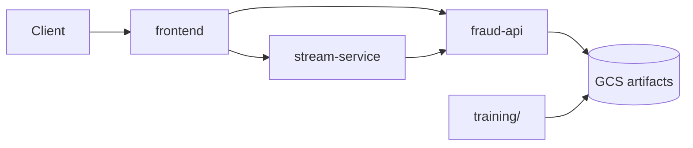

# Fraud Detection ML System (GCP)

End-to-end machine learning system for fraud detection: feature engineering, model training, FastAPI serving, and GCP deployment with CI/CD.

## Project layout

```
├── app/         # product/API/inference (api, stream, frontend)
├── training/    # model training code
├── pipelines/   # Vertex AI pipeline orchestration
├── infra/       # cloud setup (Docker Compose, GCP scripts)
├── shared/      # reusable common code (preprocess, drift, constants)
├── tests/
├── docs/
└── README.md

.github/workflows/
├── deploy-app.yml
├── train-model.yml
└── infra.yml
```

See [docs/architecture.md](docs/architecture.md) and [docs/deployment.md](docs/deployment.md) for details.

---

## Quick start (local)

```bash
cp .env.example .env
pip install -r requirements.txt
docker compose -f infra/docker-compose.yml up --build
```

| Service | URL |
|---------|-----|
| fraud-api | http://localhost:8000/docs |
| stream-service | http://localhost:8001 |
| frontend | http://localhost:3000 |

Place trained artifacts in `app/api/model/` for local inference.

---

## Training

```bash
docker build -f training/Dockerfile -t fraud-training .
docker run --rm \
  -v "$PWD/data:/data:ro" \
  -v "$PWD/outputs:/outputs" \
  fraud-training \
  --train-transaction /data/train_transaction.csv \
  --train-identity /data/train_identity.csv \
  --test-transaction /data/test_transaction.csv \
  --test-identity /data/test_identity.csv \
  --output-dir /outputs/model
```

Or without Docker:

```bash
pip install -r training/requirements.txt
python training/xgb_train.py --output-dir app/api/model
```

Dataset: [IEEE-CIS Fraud Detection](https://www.kaggle.com/competitions/ieee-fraud-detection/data) — place CSVs in `data/`.

---

## Tech stack

| Area | Tools |
|------|--------|
| ML | Python, Pandas, XGBoost, scikit-learn |
| API | FastAPI, Pydantic |
| Frontend | React, Vite, Plotly |
| Cloud | GCS, Cloud Run, Artifact Registry, BigQuery |
| CI/CD | GitHub Actions |

---

## CI/CD workflows

| Workflow | Purpose |
|----------|---------|
| `deploy-app.yml` | Build and deploy API, stream, frontend to Cloud Run |
| `train-model.yml` | Train model in CI and upload artifacts to GCS (for Cloud Run inference) |
| `infra.yml` | Build `infra` container and bootstrap GCP resources |

Vertex AI training and pipelines are managed manually in the GCP console — not via GitHub Actions.

---

## Architecture



**Request path:** Client → **Cloud Run** (FastAPI) loads **model from GCS** and returns predictions.
