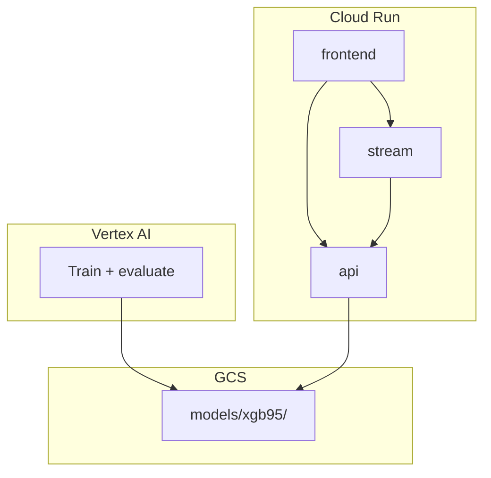

# Fraud Detection ML System (GCP)

Fraud detection system: **Vertex AI** trains and writes model artifacts to GCS; **Cloud Run** serves predictions via `api`; **GitHub Actions** deploys the app layer only when frontend, API, or stream code changes.

## Project layout

```
├── app/         # product/API/inference (api, stream, frontend)
├── training/    # model training code
├── pipelines/   # Vertex AI pipeline orchestration
├── infra/       # cloud setup (Docker Compose, GCP scripts)
├── shared/      # reusable common code (preprocess, drift, constants)
├── tests/
├── docs/
└── README.md

.github/workflows/
├── deploy-app.yml
└── infra.yml
```

See [docs/architecture.md](docs/architecture.md) and [docs/deployment.md](docs/deployment.md) for details.

---

## Quick start (local)

```bash
cp .env.example .env
pip install -r requirements.txt
docker compose -f infra/docker-compose.yml up --build
```

| Service | URL |
|---------|-----|
| api | http://localhost:8000/docs |
| stream | http://localhost:8001 |
| frontend | http://localhost:3000 |

Place trained artifacts in `app/api/model/` for local inference.

---

## Training

```bash
docker build -f training/Dockerfile -t fraud-training .
docker run --rm \
  -v "$PWD/data:/data:ro" \
  -v "$PWD/outputs:/outputs" \
  fraud-training \
  --train-transaction /data/train_transaction.csv \
  --train-identity /data/train_identity.csv \
  --output-dir /outputs/model
```

Or without Docker:

```bash
pip install -r training/requirements.txt
python training/xgb_train.py --output-dir app/api/model
```

Dataset: [IEEE-CIS Fraud Detection](https://www.kaggle.com/competitions/ieee-fraud-detection/data) — place CSVs in `data/`.

---

## Tech stack

| Area | Tools |
|------|--------|
| ML | Python, Pandas, XGBoost, scikit-learn |
| API | FastAPI, Pydantic |
| Frontend | React, Vite, Plotly |
| Cloud | GCS, Cloud Run, Artifact Registry, BigQuery |
| CI/CD | GitHub Actions |

---

## CI/CD

| Workflow | Trigger | Purpose |
|----------|---------|---------|
| `deploy-app.yml` | Push when `app/frontend`, `app/api`, `app/stream`, or `shared/` changes | Deploy only the changed Cloud Run service(s) |
| `infra.yml` | Manual only | GCP bootstrap |

**Not in CI:** training, pipelines, model artifacts — handled by **Vertex AI**.

---

## Architecture



**Serving:** frontend → api → GCS artifacts → predict (auth, SHAP, drift built in).

**Training:** Vertex custom job using `training/` container → writes to GCS. No redeploy needed when model files update in place.
