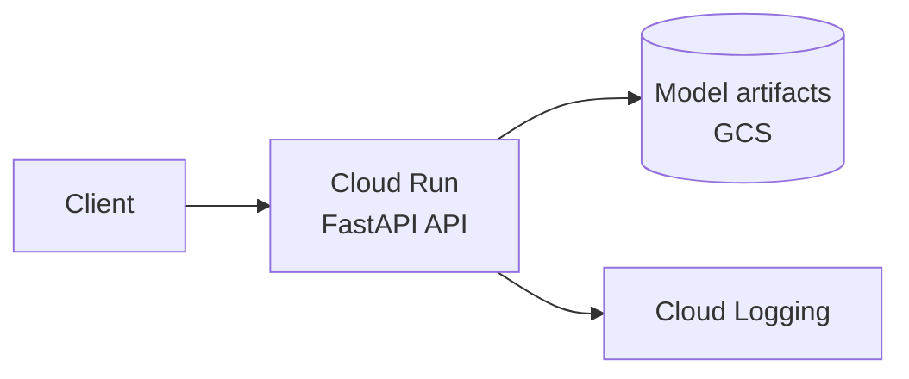

# Fraud Detection ML System (GCP)

End-to-end machine learning system for fraud detection: feature engineering, model training, FastAPI serving, and GCP deployment with CI/CD.

---

## 🧱 🧰 Solid MLE-1 Tech Stack (GCP Version)

### 🧠 ML / Data

| Area | Tools |
|------|--------|
| Language | Python |
| Tabular / numerics | Pandas, NumPy |
| Classical ML | Scikit-learn |
| Gradient boosting | LightGBM |
| Explainability | SHAP |

### ⚙️ Backend / Serving

- **FastAPI** — prediction API

### 📦 Packaging

- **Docker** — containerized API

### ☁️ GCP Services (core)

| Service | Role |
|---------|------|
| **Google Cloud Storage** | Store data + model artifacts |
| **Cloud Run** | Deploy API (serverless) |
| **Artifact Registry** | Store Docker images |
| **Cloud Build** | Automate build + deploy |

### 🔁 CI/CD

- **GitHub Actions** — trigger builds on push
- **Cloud Build** — build image and deploy

### 📊 Monitoring

- **Cloud Logging** — structured logs
- **Cloud Monitoring** — metrics and alerts

### 🧪 Dev hygiene

- **pytest** — tests
- **black** — code formatting

---

## Dataset

👉 **IEEE Fraud Detection** — transaction and identity tables for fraud classification.

---

## 🗺️ 4-Week Roadmap (GCP Blueprint)

### 📅 Week 1 — Data + Baseline

**🎯 Goal:** Get a working ML pipeline.

1. **Project structure**

   ```
   ml-fraud-gcp/
   ├── data/
   ├── notebooks/
   ├── src/
   │   ├── data/
   │   ├── features/
   │   ├── models/
   │   └── api/
   ├── tests/
   └── requirements.txt
   ```

2. **Data work** — Load transaction + identity tables; merge datasets; memory optimization (downcasting).

3. **EDA** — Imbalance analysis; missing values; basic feature understanding.

4. **Baseline model** — Logistic Regression.

5. **Evaluation** — ROC-AUC; Precision–Recall curve.

**Output:** `baseline_model.pkl`, preprocessing pipeline.

---

### 📅 Week 2 — Feature Engineering + Main Model

**🎯 Goal:** Make the pipeline production-usable.

1. **Feature engineering** — User transaction frequency; time-based patterns; aggregates (mean, std, count).

2. **Missing value strategy** — Group-based imputations; flags for missingness.

3. **Train main model** — LightGBM.

4. **Handle imbalance** — Class weights.

5. **Explainability (SHAP)** — Feature importance; individual prediction explanations.

**Output:** `model.pkl`, feature pipeline script.

---

### 📅 Week 3 — API + Docker

**🎯 Goal:** Serve the model locally.

1. **FastAPI** — Prediction endpoint.

   **Request**

   ```http
   POST /predict
   ```

   ```json
   {
     "transaction_amt": 1200,
     "user_id": "abc123"
   }
   ```

   **Response**

   ```json
   {
     "fraud_probability": 0.82
   }
   ```

2. **Load model + pipeline** — Same preprocessing as training.

3. **Input validation** — Pydantic schemas.

4. **Docker**

   ```bash
   docker build -t fraud-api .
   docker run -p 8000:8000 fraud-api
   ```

5. **Logging** — Log requests and predictions.

**Output:** Local API running; Docker image ready.

---

### 📅 Week 4 — GCP Deployment + CI/CD

**🎯 Goal:** Production-ready system.

1. **Google Cloud Storage** — Upload `model.pkl` and preprocessing artifacts.

2. **Artifact Registry** — Push Docker image.

3. **Cloud Run** — Deploy API (serverless, auto scaling, HTTPS).

4. **CI/CD** — GitHub Actions → Cloud Build:

   Push to GitHub → trigger build → build Docker image → push to Artifact Registry → deploy to Cloud Run.

5. **Monitoring** — Cloud Logging + Cloud Monitoring:

   - Prediction distribution  
   - Request latency  
   - Errors  

6. **Basic drift check** — Compare incoming features vs training distribution; log anomalies.

7. **Tests** — API tests; data validation tests.

8. **README** — Document architecture, decisions, and tradeoffs (this file).

---

## 🧠 Final Architecture



```
Client → Cloud Run (FastAPI API)
            ↓
        Model (GCS)
            ↓
    Logs → Cloud Logging
```

**Request path:** Client → **Cloud Run** (FastAPI) loads **model from GCS** and returns predictions; **Cloud Logging** captures request/prediction and operational signals.

---

## Architecture notes (for Week 4 README completion)

When you finish implementation, extend this section with:

- **Architecture** — How data, training, artifacts, and serving connect on GCP.
- **Decisions** — Why LightGBM, Cloud Run, GCS-backed models, etc.
- **Tradeoffs** — Latency vs cold start, batch vs online features, monitoring depth vs cost.
