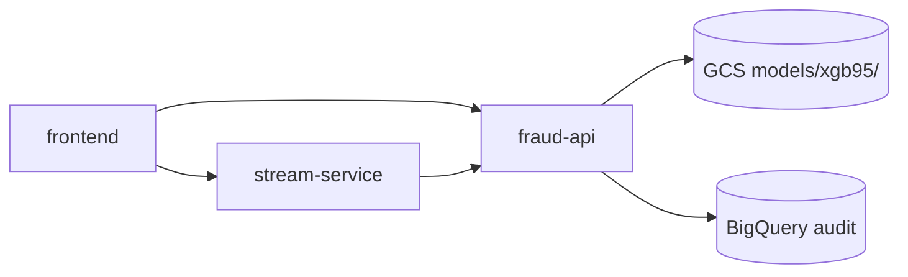
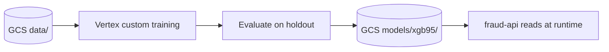

# Architecture

## Responsibility split

| Layer | Platform | Responsibility |
|-------|----------|----------------|
| **Train → evaluate → promote** | Vertex AI | Custom training job using `training/` container; writes artifacts to GCS |
| **Pipeline orchestration** | Vertex AI | Pipeline spec in GCS; schedules/runs configured in GCP console |
| **Serving** | Cloud Run (`fraud-api`) | Auth, preprocessing, predict, SHAP explain, drift; loads model from GCS |
| **Demo stream** | Cloud Run (`stream-service`) | Replays transactions; calls `fraud-api` |
| **Dashboard** | Cloud Run (`frontend`) | React UI |
| **CI/CD** | GitHub Actions | Deploys only `app/frontend`, `app/api`, or `app/stream` when those paths change |

Vertex owns the model lifecycle. Cloud Run owns the product API. Pushing training or pipeline code does **not** trigger CI.

## Layout

```
├── app/         # product/API/inference
├── training/    # Vertex custom training container source
├── pipelines/   # Vertex pipeline spec (compile + upload to GCS manually)
├── infra/       # local Docker Compose + GCP bootstrap scripts
├── shared/      # preprocessing/drift code (used by training + fraud-api)
├── tests/
└── docs/
```

## Serving flow



## Training flow (Vertex AI)



`training/xgb_train.py` exports artifacts that match `fraud-api` env paths:

- `xgb95.ubj`, `xgb95_encoders.pkl`, `xgb95_features.pkl`
- `xgb95_train_stats.pkl`, `xgb95_metadata.json`, `xgb_threshold.json`

When Vertex writes new artifacts to the same GCS prefix, **fraud-api picks them up without redeploy** (Cloud Run GCS volume mount).

## CI/CD triggers

`deploy-app.yml` runs on push to `main` only when these change:

| Path | Deploys |
|------|---------|
| `app/api/**` or `shared/**` | `fraud-api` |
| `app/stream/**` | `stream-service` |
| `app/frontend/**` | `frontend` |

Changes to `training/`, `pipelines/`, `infra/`, `docs/`, etc. do **not** trigger CI.

`infra.yml` is manual only (`workflow_dispatch`).
